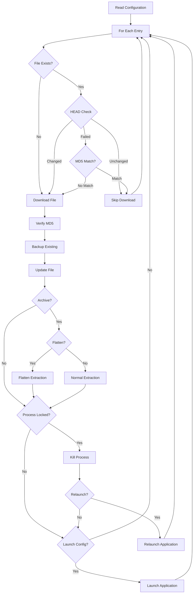

[](https://stand-with-ukraine.pp.ua)
[](https://stand-with-ukraine.pp.ua)
[](https://stand-with-ukraine.pp.ua)
[](https://stand-with-ukraine.pp.ua)


# Update Checker

A Python utility for automatically checking and downloading updates for files and GitHub releases. It supports MD5 verification, automatic process management, archive handling, and parallel chunked downloads.

## Features

- **Download and update files from URLs and GitHub releases**
- **Parallel chunked downloads** - Auto-detects large files (≥10MB) and downloads in parallel chunks for faster transfers
- **MD5 checksum verification** - Verify file integrity after download
- **HTTP HEAD optimization** - Skip downloads when file hasn't changed (ETag, Last-Modified, Content-Length checks)
- **Automatic backup of existing files**
- **Process management** - Kill and relaunch capabilities for locked files
- **Archive extraction support** - Automatic unzip with optional flatten mode
- **Concurrent processing** - Thread pooling for multiple entries
- **GitHub API support** - Authenticated requests with token to avoid rate limits
- **Typer-based CLI** - Clean command-line interface with auto-completion

## How it works

<details>
<summary>Click to expand flowchart</summary>



</details>

## CLI Usage

```bash
# Basic usage - check all entries
uv run updatechecker

# Use specific config file
uv run updatechecker --config /path/to/config.yaml

# Process specific entries only
uv run updatechecker --entries entry1,entry2,entry3

# Force re-download (skip HEAD/MD5 checks)
uv run updatechecker --force

# Disable parallel processing
uv run updatechecker --no-async

# Set number of threads for parallel processing
uv run updatechecker --threads 4

# Provide GitHub token for API requests
uv run updatechecker --gh-token ghp_your_token

# Enable verbose output
uv run updatechecker --verbose
```

### CLI Options

| Option | Short | Description |
|--------|-------|-------------|
| `--config` | `-c` | Path to config file (default: `~/updatechecker.yaml`) |
| `--async/--no-async` | | Enable/disable parallel processing (default: enabled) |
| `--threads` | `-t` | Number of threads for parallel processing (default: CPU count - 1) |
| `--entries` | `-e` | Comma-separated list of entry names to check (default: all) |
| `--force` | | Force re-download, skip HEAD/MD5 checks |
| `--verbose` | `-v` | Enable verbose output (DEBUG log level) |
| `--gh-token` | | GitHub token for API requests (overrides config and `GITHUB_TOKEN` env var) |

## Configuration

Create `updatechecker.yaml` in `%USERPROFILE%` or in the cloned repository folder. See [updatechecker.example.yaml](updatechecker.example.yaml) for a complete example with detailed comments.

### Quick Example

```yaml
# Optional: GitHub token for authenticated API requests
github_token: 'ghp_abc123'

variables:
  games_dir: 'D:\Games'
  tools_dir: '{{games_dir}}\Tools'

entries:
  my_tool:
    url: "https://github.com/user/repo"
    git_asset: 'tool.*\.zip'      # Regex pattern for GitHub release asset
    target: '{{tools_dir}}\tool.zip'
    unzip_target: '{{tools_dir}}\tool'
    chunked_download: true         # Enable parallel download for large files
    flatten: true                  # Skip redundant versioned folder in zip
```

### Entry Options

| Option | Type | Description |
|--------|------|-------------|
| `url` | string | URL to download from or GitHub repo URL |
| `git_asset` | string | Regex pattern to match GitHub release asset |
| `md5` | string | URL containing MD5 hash for verification |
| `target` | string | Full path to save downloaded file |
| `unzip_target` | string | Directory to extract archive to |
| `archive_password` | string | Password for encrypted archives |
| `kill_if_locked` | string | Process path/name to kill if file is locked |
| `relaunch` | bool | Relaunch the killed process (default: false) |
| `launch` | string | Path to launch after download |
| `arguments` | string | Arguments for launch command |
| `flatten` | bool | Skip redundant parent folder in zip (default: false) |
| `chunked_download` | bool | Enable parallel chunked download (default: auto-detect) |
| `use_content_length_check` | bool | Use file size check when metadata missing (default: true) |

## Getting Started

### Installation

1. Clone this repository:
   ```bash
   git clone https://github.com/ALERTua/updatechecker.git
   ```
2. Install [uv](https://docs.astral.sh/uv/getting-started/installation/)
3. Create config from example:
   ```bash
   cp updatechecker.example.yaml ~/updatechecker.yaml
   ```
4. Edit config and run:
   ```bash
   uv run updatechecker
   ```
